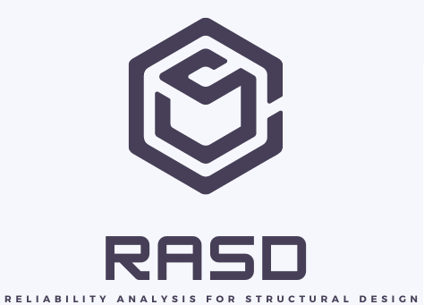

<h1>Welcome to RASD Toolbox</h1>

<table>
<tr>
<td style="width:70%;">
The RASD tool is an easy-to-use environment for applying the reliability methods. The platform has several methods implemented, in addition to extra functions for viewing the results.
</td>
<td style="width:30%;"></td>  
</tr>
</table>  

_**Developers**_  

**Managers Team:**   
- [Prof. Wanderlei Malaquias Pereira Junior](http://lattes.cnpq.br/2268506213083114)  
- [Prof. Romes Antônio Borges]()

**Students Team:**    
- Civil Engineer Donizetti Aparecido de Souza Júnior

_**Index**_  
1.0 - Installation  
1.1 - [How to install](https://wmpjrufg.github.io/FINITO_TOOLBOX/CAP_1-1.html)  
2.0 - Finito FEM Toolbox   
2.1 - [How to use MEF1D framewrok](https://wmpjrufg.github.io/FINITO_TOOLBOX/CAP_2-1.html)   
2.2 - [How to use MEF2D framewrok](https://wmpjrufg.github.io/FINITO_TOOLBOX/CAP_2-2.html)   
